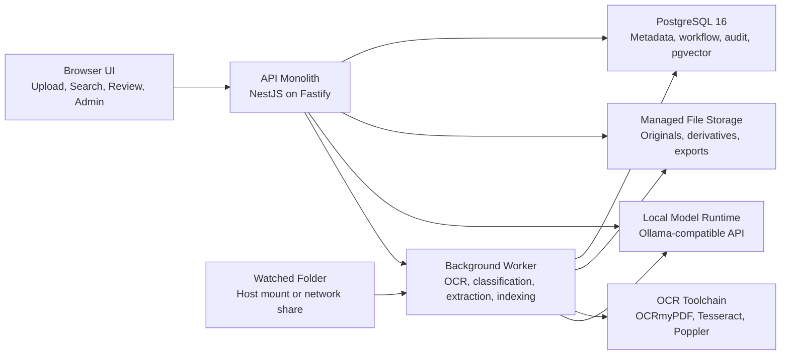

# MVP Architecture

## Recommendation

ProjectDoc Local should be built as a modular monolith with one web application, one API application, one background worker, one PostgreSQL database, managed filesystem storage for documents, and a local model runtime behind explicit provider interfaces.

This is the right MVP shape for the product:

- it fits the current TypeScript monorepo direction already documented in the repository
- it keeps the trust boundary tight for on-prem single-machine installs
- it avoids premature microservice complexity
- it supports background processing without turning the system into a distributed platform
- it leaves room to swap OCR, extraction, embedding, and answer-generation components later

## System Diagram

## Runtime Components

### 1. Web UI

The browser UI handles:

- drag-and-drop upload
- document search and filtering
- side-by-side review of source pages and extracted fields
- Q&A over indexed documents with page citations
- admin screens for watched folders, rules, exports, and user management

The UI should be a separate frontend project during development, but its compiled assets should be served by the API in production to keep the runtime shape simple.

### 2. API Monolith

The API is the main system boundary for users and integrations. It should be one deployable application with clear internal modules, not a collection of network services.

Recommended API modules:

- `auth`: login, sessions, roles
- `documents`: upload, metadata, lifecycle state
- `search`: filtering, hybrid retrieval, citation lookup
- `qa`: retrieval-augmented answering with citation enforcement
- `review`: review queues, approvals, edits, exceptions
- `admin`: watched folder configs, model/provider settings, export templates
- `exports`: CSV export jobs and downloads
- `audit`: append-only event creation and query APIs

The API should expose a REST interface. GraphQL adds very little value to this product at MVP stage and would increase complexity in review, audit, and export flows.

### 3. Background Worker

The worker handles all non-interactive, long-running, or failure-prone processing:

- watched folder scanning and deduplication
- OCR and text extraction
- page splitting and chunking
- document classification
- field extraction
- embedding generation
- search index updates
- export generation

This process should share code and schemas with the API, but run independently so ingestion and OCR work cannot degrade interactive UI performance.

### 4. PostgreSQL as the System of Record

PostgreSQL should hold:

- users and sessions
- projects and counterparties
- document metadata and workflow status
- extraction results and reviewed values
- review tasks and decisions
- audit events
- chunk text and vector embeddings
- export job metadata

PostgreSQL should also provide:

- full-text search
- vector search through `pgvector`
- durable job queue backing through `pg-boss`

For the MVP, one database is better than splitting responsibility across PostgreSQL, Redis, and a separate search engine.

### 5. Filesystem Storage

Original documents, OCR derivatives, rendered previews, and generated exports should live on the local filesystem under a managed storage root. Metadata stays in PostgreSQL.

This is the right v1 choice because:

- the deployment target is one machine
- it reduces operational overhead
- it simplifies backup and restore
- it is enough until the product actually needs shared object storage

Use content-addressed or UUID-based managed paths rather than preserving user-provided filenames as storage keys.

### 6. Local Model Runtime

Model-backed features should go through provider interfaces owned by ProjectDoc Local rather than being wired directly into application code.

Core interfaces should include:

- `OcrProvider`
- `DocumentClassifier`
- `FieldExtractor`
- `EmbeddingProvider`
- `AnswerGenerator`

The default MVP provider should be an Ollama-compatible local runtime because it is easy to package on a single machine. The application code should not assume specific model names or vendors.

## Core Processing Flows

### Upload Flow

1. User uploads a file through the web UI.
2. API stores the original file in managed storage and creates a `document` record.
3. API enqueues a processing job.
4. Worker performs OCR or text extraction, classification, field extraction, and indexing.
5. API surfaces the document as `ready` or `needs_review` based on confidence and rules.

### Watched Folder Flow

1. Worker watches configured host-mounted folders.
2. Newly discovered files are copied into managed storage.
3. The worker records source metadata, hashes the file, deduplicates if needed, and creates the same document pipeline job used for uploads.
4. Files that fail processing are moved to a configured failure or quarantine path and logged.

### Review Flow

1. The worker writes extraction candidates and confidence scores.
2. Rule checks decide whether the document can be marked ready or must enter review.
3. Reviewers compare proposed values against cited page evidence.
4. Edits, approvals, and rejections are persisted and written to the audit log.
5. Approved values become the current exportable record.

### Search and Q&A Flow

1. The API runs hybrid retrieval over `document_chunks` using PostgreSQL full-text search plus vector similarity.
2. The top chunks are grouped by document and page.
3. The answer generator receives only retrieved evidence and must return citations tied to stored chunk or page identifiers.
4. If retrieval is weak, the system should abstain rather than fabricate an answer.

## Modular Inference Design

The model boundary should sit in the worker and search modules, not inside controllers or UI code.

Recommended pattern:

- keep provider configuration in one place
- pass typed request and response objects through internal interfaces
- store raw provider outputs for debugging only where useful and safe
- normalize all provider output into product-owned schemas before persistence

That approach lets the team change OCR or model vendors later without rewriting workflow logic, review screens, or audit semantics.

## Why This Fits the Product

- Single-machine deployment is practical because the architecture has only one database and one file store.
- Human review is first-class because extraction candidates, evidence, and decisions are explicit product entities.
- Auditability is natural because the API owns all state changes and writes append-only audit events.
- Shipping velocity stays high because there are only two application runtimes to build and operate: API and worker.
- Future productization is still supported because storage, retrieval, and model adapters are isolated behind clean interfaces.

## Tradeoffs

- This architecture is intentionally less horizontally scalable than a distributed event-driven system.
- Filesystem storage is simpler than object storage, but it makes future multi-node expansion a migration project.
- PostgreSQL hybrid search is good enough for the MVP, but not as feature-rich as a dedicated search engine.
- Ollama-compatible local inference is operationally simple, but model performance will vary across customer hardware.
- A modular monolith requires discipline in code organization because there is no network boundary forcing separation.

## Rejected Alternatives

### 1. Microservices plus message bus

Rejected because the MVP does not need service-by-service scaling, independent deployment, or a distributed event platform. It would slow the team down and make on-prem support harder.

### 2. Separate Redis queue and separate search cluster

Rejected because Redis plus OpenSearch or Elasticsearch adds two more stateful systems without solving the MVP's main problem. PostgreSQL can handle queueing, metadata, full-text search, and vector search well enough at this stage.

### 3. Full Python backend as the primary product surface

Rejected because the repository already points toward a TypeScript product stack, and shared typing across API, web, and worker improves velocity. Python remains acceptable inside external OCR and model runtimes, but it should not define the whole product architecture in v1.

### 4. Next.js as the entire application platform

Rejected because ProjectDoc Local still needs a dedicated worker, explicit document pipeline modules, and server-side job orchestration. Next.js would add SSR and framework coupling without simplifying the core back-office workflow problem.

### 5. Kubernetes-first deployment

Rejected because the MVP target is one machine. Docker Compose is simpler to install, support, back up, and reason about for early pilots.
