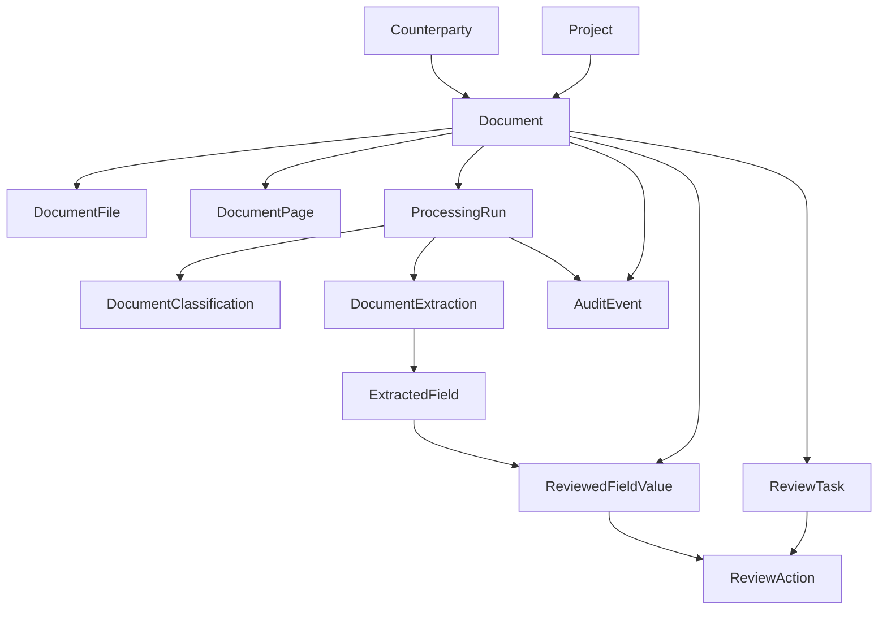

# Domain Model

## Purpose

ProjectDoc Local needs a domain model that is operationally clear before it becomes technically clever. The MVP should make four things obvious:

1. what source document the system received
2. what the system extracted from that document
3. what a human reviewer accepted or corrected
4. what evidence supports each extracted or reviewed fact

The model in code now lives in:

- `packages/shared/src/domain/*` for shared TypeScript and Zod schemas
- `apps/api/prisma/schema.prisma` for the initial relational persistence model

## Core Modeling Rules

- Source documents are immutable records of what entered the system.
- Machine extraction output is immutable per processing run.
- Human-reviewed values are a separate layer, not an in-place mutation of machine output.
- Every extracted fact can cite a document page or segment.
- Audit events are append-only.
- The MVP favors one clear model over many document-type-specific tables.

## Core Entities

### Business Context

#### Project

Represents the job or internal work context documents belong to.

#### Counterparty

Represents the outside organization or party tied to the document, such as a vendor, subcontractor, carrier, or inspector.

#### User

Represents an authenticated operator, reviewer, or administrator acting inside the system.

### Source Document Layer

These entities describe the incoming document as received, independent of AI output.

#### Document

The top-level record for one uploaded or ingested file. It carries:

- document type as the current system classification
- lifecycle status
- source type and source reference
- project and counterparty association
- original filename, MIME type, and file hash

#### DocumentFile

Tracks binary artifacts stored on disk, such as the original file, OCR-derived PDF, preview image, or CSV export.

#### DocumentPage

Stores page-level text and image references so the system can anchor citations and review screens to real page evidence.

### Machine Extraction Layer

These entities are immutable outputs from one processing run.

#### ProcessingRun

Represents one end-to-end system attempt to process a document. It is the parent record for classification and extraction output and gives the product a stable trace of reprocessing over time.

#### DocumentClassification

Stores the system's predicted document type, confidence, and classification method for a specific processing run.

#### DocumentExtraction

Represents the structured extraction snapshot produced for a specific processing run. It identifies the extraction schema name and version plus overall confidence.

#### ExtractedField

Represents one machine-produced fact such as:

- invoice number
- permit expiration date
- COI policy effective date
- change order amount

Each extracted field stores:

- the field key and label
- the extracted value
- normalized text when useful
- confidence
- citations
- provenance

This entity is the main traceability anchor for machine output.

### Human Review Layer

These entities represent human workflow and the authoritative value layer.

#### ReviewTask

Represents a queue item for a document that needs human attention. It exists because of low confidence, missing required fields, conflicting values, OCR quality problems, or policy rules.

#### ReviewedFieldValue

Represents the current authoritative field value for a document.

This is intentionally separate from `ExtractedField`.

That separation matters because:

- `ExtractedField` preserves what the system originally proposed
- `ReviewedFieldValue` preserves what the business currently accepts

The override model is explicit:

- `machineValue` stores the machine-proposed value
- `authoritativeValue` stores the value the product should use downstream
- `authoritativeValueSource` shows whether the authoritative value came from the machine or a human
- `sourceExtractedFieldId` links a reviewed value back to the machine fact it came from

If a reviewer changes a machine-proposed amount, date, or name, the system does not overwrite the machine fact. Instead, the reviewed field records a human-authored authoritative value and points back to the original extracted fact.

#### ReviewAction

Represents a concrete reviewer action such as approve, correct, reject, assign, or comment. This preserves action history without forcing the current reviewed field record to carry the whole event log.

### Provenance and Traceability Layer

#### SourceCitation

Each extracted fact can point back to:

- the source document
- the page number
- the stored chunk or segment when available
- the bounding box when page coordinates are available
- an excerpt when useful

This is the minimum evidence model required for trustworthy review and citation-backed Q&A.

#### Provenance

Each machine-produced fact also stores provenance for how it was produced:

- processing run
- provider name
- provider version
- method
- model name when relevant

This lets the product distinguish between the source document, the machine fact, and the technical path that produced that fact.

#### AuditEvent

Audit events capture material changes and workflow events across the domain, including intake, processing milestones, review actions, approvals, exports, and admin changes.

### Export Layer

#### ExportJob

Represents a requested CSV export and the filter set used to create it. Export jobs are intentionally modeled as workflow records rather than anonymous file writes so the system can trace what was exported and when.

## How the Model Fits Together

## Four Distinct Data Concerns

### 1. Source Document Metadata

Owned by:

- `Document`
- `DocumentFile`
- `DocumentPage`

This layer answers: what file did we receive, from where, and how is it stored?

### 2. Extracted Structured Data

Owned by:

- `ProcessingRun`
- `DocumentClassification`
- `DocumentExtraction`
- `ExtractedField`

This layer answers: what did the system think the document means?

### 3. Human-Reviewed Corrections

Owned by:

- `ReviewTask`
- `ReviewedFieldValue`
- `ReviewAction`

This layer answers: what did a human accept, correct, or reject?

### 4. Confidence, Provenance, and Citations

Owned primarily by:

- `ExtractedField`
- `ReviewedFieldValue`
- `AuditEvent`

This layer answers: why should anyone trust the value, and what evidence supports it?

## Authoritative Value Rule

The MVP should use this rule consistently:

- machine output is never silently rewritten
- downstream exports and operational views use `ReviewedFieldValue.authoritativeValue`
- if `authoritativeValueSource` is `machine`, the system is using the machine proposal as-is
- if `authoritativeValueSource` is `human`, a reviewer has overridden the machine proposal

This keeps the product auditable without making the schema too complicated.

## Current Code Shape

The shared domain package now includes:

- project, counterparty, user, document, extraction, review, export, and audit schemas
- aggregate record shapes that distinguish source records from machine and reviewed records
- reusable confidence, metadata, JSON value, and citation schemas

The Prisma schema mirrors the same concepts with:

- immutable source and extraction records
- a separate `ReviewedFieldValue` model for authoritative values
- review actions and audit events as distinct history mechanisms

## Schema Decisions To Revisit Later

- Whether users need multi-role assignment instead of the current single-role model.
- Whether some high-value document types should eventually get typed field tables instead of generic JSON-backed extracted values.
- Whether reviewed field values need a separate version-history table beyond the current review action trail.
- Whether a document should support multiple counterparties instead of one primary counterparty in the MVP model.
- Whether export artifacts should move from `outputPath` into the same managed file artifact model used by document binaries.
