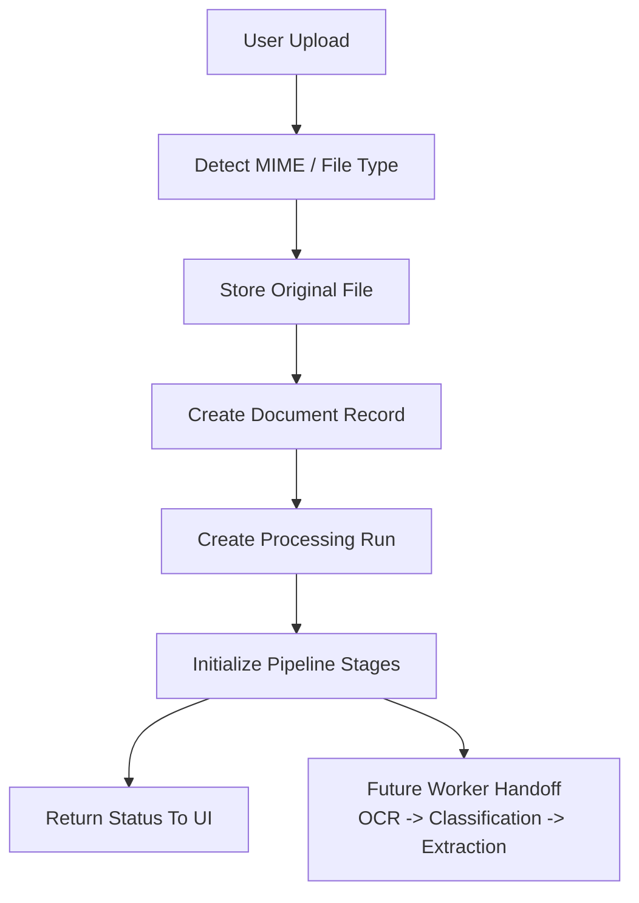

# Ingestion Lifecycle

## Purpose

The first ingestion slice handles one job well: accept a local file upload, store the original file, create a durable document record, and queue downstream processing stages without pretending OCR or extraction already exist.

This keeps the upload boundary stable while the worker pipeline grows behind it.

## Thin Slice Responsibilities

The current implementation covers:

- multipart file upload from the web UI
- MIME and file-type detection for supported formats
- managed file storage under the configured storage root
- creation of a persistent document intake record
- initial document status transition into processing
- durable stage queueing for OCR, classification, and extraction

It does not yet execute OCR, classification, or extraction.

## Lifecycle Flow

## Current Document State Flow

1. The API receives a multipart upload with a `file` field.
2. The ingestion service validates that a non-empty file was provided.
3. MIME detection checks file signatures first, then falls back to reported MIME type or file extension.
4. The file storage service writes the original file to managed storage and computes its SHA-256 hash.
5. The ingestion service creates the initial `Document` and `DocumentFile` records.
6. The pipeline orchestrator creates a queued `ProcessingRun` and initializes pipeline stages.
7. The document transitions from `ingested` to `processing`.
8. The document intake snapshot is persisted and returned to the UI.

## Stage Model

The thin slice tracks four pipeline stages:

- `storage`
- `ocr`
- `classification`
- `extraction`

Stage states are:

- `pending`
- `queued`
- `running`
- `completed`
- `failed`

Initial upload behavior:

- `storage` becomes `completed` once the original file is written and the record is created
- `ocr` becomes `queued` for scanned/image-style uploads, or `completed` for text-native uploads
- `classification` starts as `pending` or `queued` depending on whether OCR is needed first
- `extraction` starts as `pending`

## Document Status Lifecycle

The shared lifecycle helper currently allows these document status transitions:

- `ingested -> processing | failed`
- `processing -> classified | failed`
- `classified -> extracted | needs_review | failed`
- `extracted -> needs_review | approved | failed`
- `needs_review -> approved | rejected | failed`
- `approved -> exported`
- `failed -> processing`

The ingestion slice uses the first transition only. The remaining transitions are reserved for future worker and review flows.

## Error Handling

Uploads fail clearly when:

- no file is provided
- the file is empty
- the detected type is unsupported
- storage succeeds but record creation cannot be finalized

When record finalization fails after the file has already been written, the API removes the stored file to avoid orphaned intake artifacts.

## Persistence Shape

The thin slice currently persists one JSON document per uploaded file under the configured storage root. That snapshot includes:

- the `Document`
- associated `DocumentFile` entries
- the queued `ProcessingRun`
- current pipeline stage statuses

This is an intentional adapter boundary so the API can move to a Prisma-backed repository later without rewriting the upload controller or the ingestion orchestration service.

## Next Worker Handoff

When background processing lands, the worker should:

1. load the persisted document record
2. claim the queued processing run
3. update stage state from `queued` or `pending` into `running`
4. write OCR, classification, and extraction outputs back into the document domain
5. advance the document lifecycle according to the shared status transition rules

That future handoff is why storage, MIME detection, persistence, and orchestration are already separate services in the API slice.
